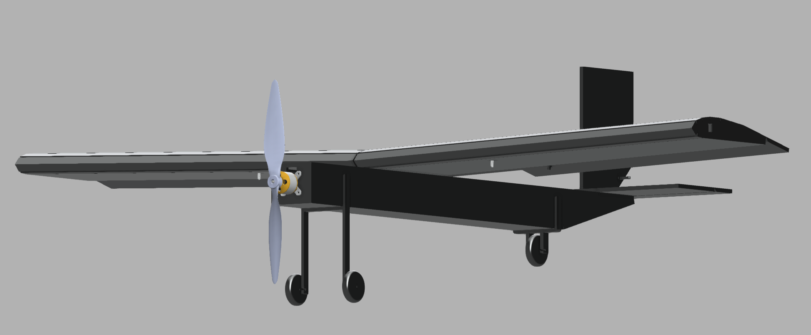

# RC Plane - Foam Board Trainer

A 1 m wingspan fixed-wing RC plane, hand-cut from 5 mm foam board and modeled after the main proportions of the B-29 Superfortress for its lift-heavy, slow, and efficient flight characteristics. Airfoil selected from the UIUC NACA airfoil database by comparing lift, drag, and angle-of-attack data.

*Built summer 2026*

---

## CAD Model

**[→ Open the interactive CAD model](https://a360.co/45A5CbB)**

---

## Overview

- Modeled after the main dimensional proportions of the B-29 Superfortress, chosen for a lift-heavy, slow-flying, efficient profile rather than speed
- Selected the wing airfoil from the UIUC NACA database, comparing lift, drag, and angle-of-attack data across candidate profiles
- Modeled the full airframe in CAD, sized around 5 mm foam board stock from the start
- Single-engine configuration: A2212 1000KV motor turning a 1045 propeller, for a cruise speed of ~10.5 m/s

## Fabrication Process

- **Flattened** the 3D CAD model — unfolded the airframe's surfaces into flat, 2D cut patterns matching the foam board thickness, taking inspiration from how a sheet metal part is processed for cutting.
- Many cut patterns ran longer than a standard printer page, and tiling multiple printed sheets together introduced misalignment.
- Solved this by exporting the flattened patterns to true scale as engineering blueprints (via Adobe PDF software) and having them printed full-size on engineering paper at Staples.
- Hand-cut the entire airframe from 5 mm foam board using the full-scale prints directly as templates

## Materials & Weight

| Part | Spec | Qty | Weight |
|---|---|---|---|
| A2212 1000KV Brushless Motor | 2–3S outrunner | 1 | 55 g |
| 1045 Propeller | 10x4.5 in | 1 | 12 g |
| 11.1V 2000mAh 3S LiPo Battery | matched to motor | 1 | 155 g |
| FlySky FS-i6B Receiver | 6-channel, AFHDS 2A | 1 | 15 g |
| FlySky FS-i6 Transmitter | 6-channel, handheld | 1 | N/A |
| Servo | 9g micro class | 4 | 36 g total |
| Carbon Fiber Spar | 420 mm, 6 mm OD / 4 mm ID | 2 | 21 g total (calculated from tube geometry) |
| Foam Board | 5 mm, 20"×30" sheet | 2 | 210 g/sheet|

**Onboard weight: 294g**

## Specs

| Spec | Value |
|---|---|
| Wingspan | 1 m |
| Cruise speed | ~10.5 m/s |
| Design inspiration | B-29 Superfortress (proportional dimensions) |
| Airfoil source | UIUC NACA airfoil database |
| Motor configuration | Single engine, A2212 1000KV, 1045 prop |
| Airframe material | 5 mm foam board with kraft paper layers|

## Media

*(To be added — build photos and flight footage)*

---
